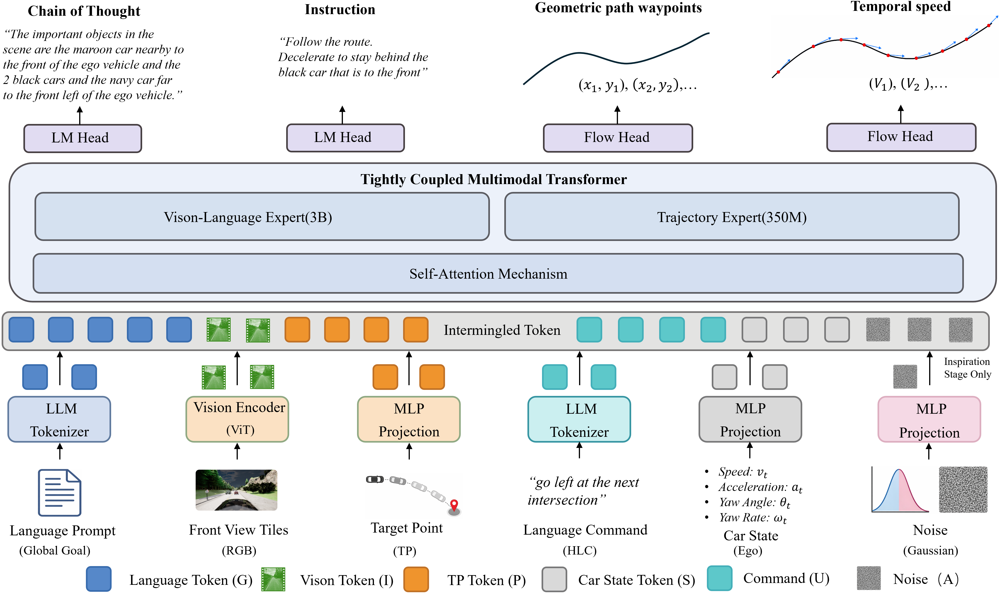
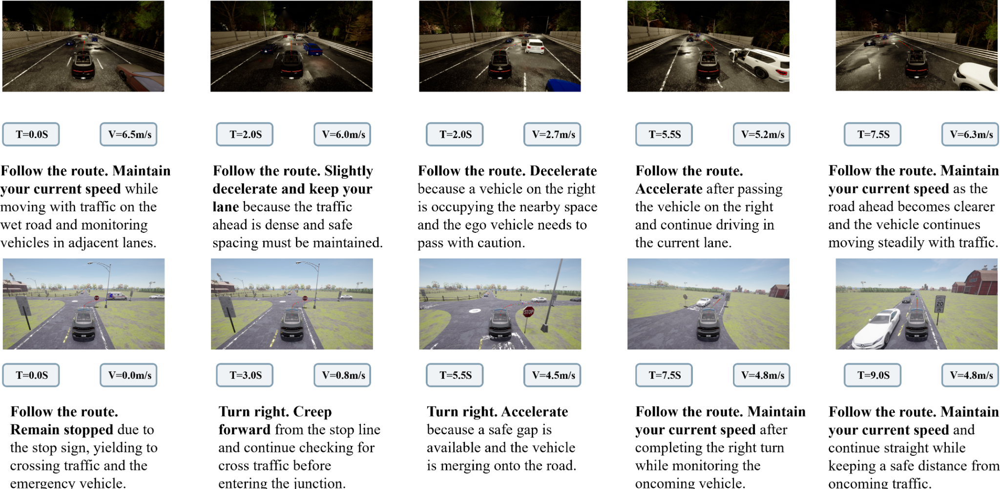

# VECTOR-Drive: Tightly Coupled Vision-Languageand Trajectory Expert Routing for End-to-EndAutonomous Driving

<p align="center">
  <b>VECTOR-Drive</b>  is a tightly coupled Vision-Language-Action framework for autonomous driving, designed to enhance semantic-motion alignment through shared cross-modal attention and trajectory-oriented expert routing.
</p>

<p align="center">
  <a href="https://infinidrive.github.io/VLADriver-RAG/">Project Page</a> •
  <a href="https://arxiv.org/abs/2605.08830">arXiv</a> •
</p>

<p align="center">
  
</p>

## News
- **[2026/05/12]** 👉 We released our paper on [arXiv](https://arxiv.org/abs/2605.08830).
---


## Visualization
<p align="center">
  
<p>
    In challenging corner-case driving scenarios, <b>VECTOR-Drive</b> generates temporally consistent and interpretable planning results.
    In the nighttime dense-traffic case, the model maintains a safe speed with surrounding vehicles, decelerates when a nearby vehicle
    occupies the adjacent space, and accelerates after the road becomes clearer. In the stop-controlled junction case, VECTOR-Drive
    remains stopped to yield to crossing traffic and the emergency vehicle, creeps forward to check safety, and proceeds only when a safe
    gap is available. These qualitative results demonstrate that VECTOR-Drive effectively aligns visual scene understanding,
    language-level driving intent, and speed-aware trajectory generation, leading to robust and safe planning under complex interactive
    environments.
</p>
## Quick start

 <p>
 Coming soon
 </p>

---

## Citation
```bibtex
@article{zhao2026vector,
  title={VECTOR-Drive: Tightly Coupled Vision-Language and Trajectory Expert Routing for End-to-End Autonomous Driving},
  author={Zhao, Rui and Yu, Jianlin and Gao, Zhenhai and Liu, Jiaqiao and Gao, Fei},
  journal={arXiv preprint arXiv:2605.08830},
  year={2026}
}
```
